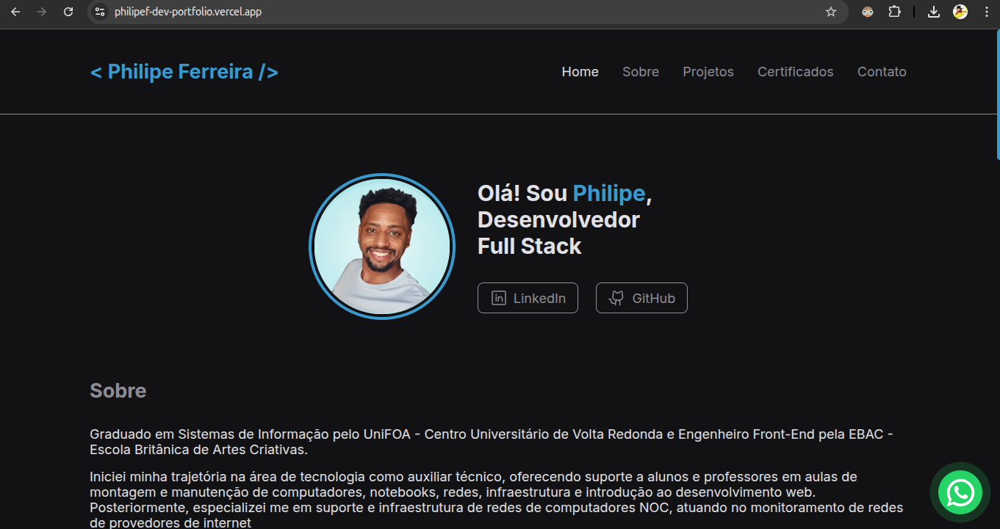

<h1 align="center" style="text-align: center;">
  👩🏽‍💻 Portfólio Philipe Ferreira Desenvolvedor Web
</h1>

> Meu portfólio de desenvolvedor

<p align="center">
  <a href="#project">Projeto</a>&nbsp;&nbsp;&nbsp;|&nbsp;&nbsp;&nbsp;
  <a href="#technologies">Tecnologias</a>&nbsp;&nbsp;&nbsp;|&nbsp;&nbsp;&nbsp;
  <a href="#usage">Utilização</a>&nbsp;&nbsp;&nbsp;|&nbsp;&nbsp;&nbsp;
  <a href="#license">Licença</a>
</p>

<p align="center">
  
</p>

<h2 id="project">📁 Projeto</h2>

O projeto compreende a criação do meu portfólio como desenvolvedor. Nele, faço uma apresentação pessoal, compartilho insights sobre minha trajetória, destaco as tecnologias que domino, exibo os principais projetos que desenvolvi, apresento os certificados de cursos que completei e disponibilizo minhas informações de contato.

<!--  -->

<h2 id="technologies">💻 Tecnologias</h2>

Este projeto foi desenvolvido com as seguintes tecnologias:

- ReactJS
- ReactDOM
- Phosphor Icons
- React Responsive
- Styled Components
- SwiperJS
- ViteJS

<h2 id="usage">💡 Utilização</h2>

A aplicação está disponível para uso [aqui](https://philipef-dev-portfolio.vercel.app). Você também pode executá-la em sua máquina localmente. Certifique-se de ter o `Node.js` e o `npm` instalados antes de prosseguir com as etapas abaixo:

1. Clone o projeto:

```
$ git clone https://github.com/philipef/philipef-dev-portfolio.git
```

2. Acesse a pasta do projeto:

```
$ cd philipef-dev-portfolio
```

3. Instale as dependências:

```
$ npm install
```

4. Inicie o servidor:

```
$ npm run dev
```

<h2 id="license">📝 Licença</h2>

Este projeto está sob a licença MIT.

---

Philipe Ferreira - Desenvolvedor Web 👨🏾‍💻

<div style="display: flex;">
  <a href="https://www.linkedin.com/in/philipef-dev" target="_blank"></a>
  <a href="mailto:philipefdev@gmail.com"></a>
  <a href="http://discordapp.com/users/689830389371633742" target="_blank"></a>
  <a href="https://www.instagram.com/_philipeferreiraa" target="_blank"></a>
</div>
